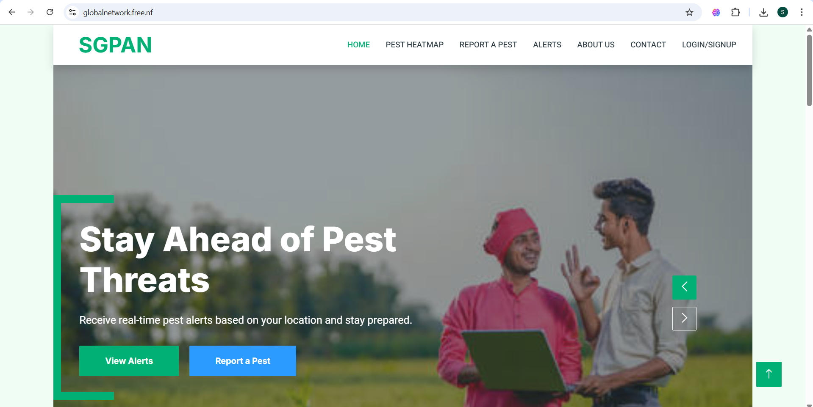
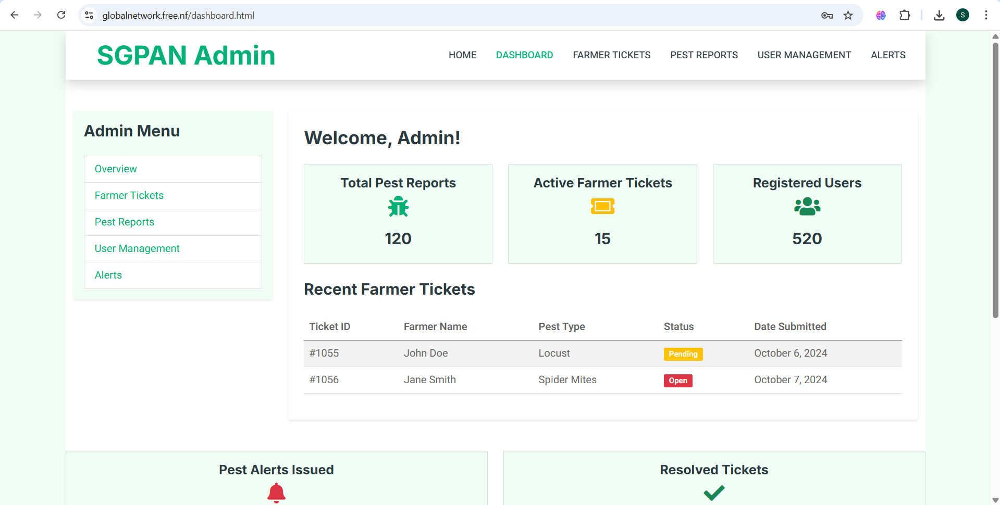

# 🐞 Smart Global Pest Alert Network (HTML + PHP)


The **Smart Global Pest Alert Network (SGPAN)** is a web-based platform designed to help **farmers, researchers, and administrators** monitor and respond to pest outbreaks effectively.  
The system integrates **ground-based observations** with satellite data, providing **real-time alerts, dashboards, and tracking features**.  

---

## 🚀 Features

### 🌱 Farmer Dashboard
- Submit pest observations from the field  
- Access real-time pest alerts in their region  
- View satellite data insights (Landsat SR integration)  
- Download guides & resources for pest management  

### 🛠️ Admin Dashboard
- Manage farmer reports & tickets  
- Approve / verify pest alerts  
- Visual analytics with charts & statistics  
- Monitor regional pest outbreaks  

### ⚙️ Backend (PHP + MySQL)
- Secure login/signup system for farmers & admins  
- Pest observation ticket management  
- Stores farmer-submitted data in MySQL  
- Tracks user activity & last login  
- Generates reports for decision-making  


## ⚙️ Installation & Setup

1. **Clone Repository**
   ```bash
   git clone https://github.com/ShubhamMaster/smart-global-pest-alert-network.git
   cd smart-global-pest-alert-network
Set Up Database

Create a new MySQL database (e.g., sgpan_db)

Import database.sql into MySQL

Update includes/connection.php with your DB credentials:

php
Copy code
$servername = "localhost";
$username   = "root";
$password   = "";
$dbname     = "sgpan_db";

# Run Local Server

Place files inside htdocs/ (XAMPP/LAMP/WAMP)
Start Apache & MySQL

Open in browser:
http://localhost/smart-global-pest-alert-network/

### 📸 Screenshots
  
  

🔗 Live Demo
👉 Visit Smart Global Pest Alert Network

📧 Contact
📩 Email: shubhamdighe45@gmail.com

💼 LinkedIn: Linkedin Profile/shubhamdighe

🐙 GitHub: @ShubhamMaster


